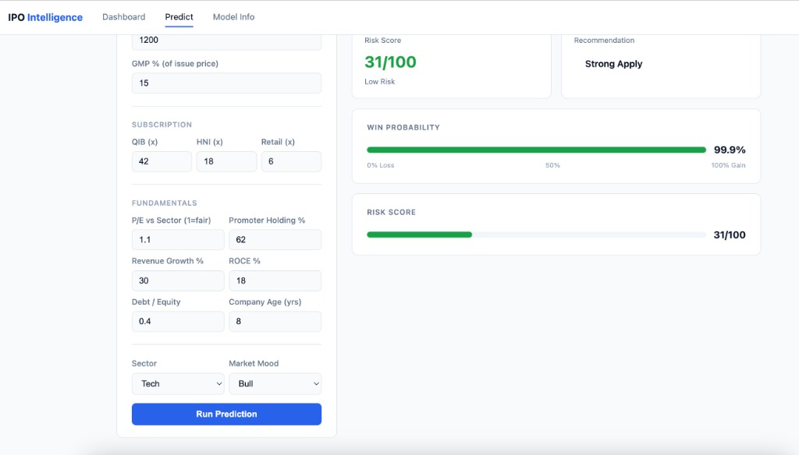
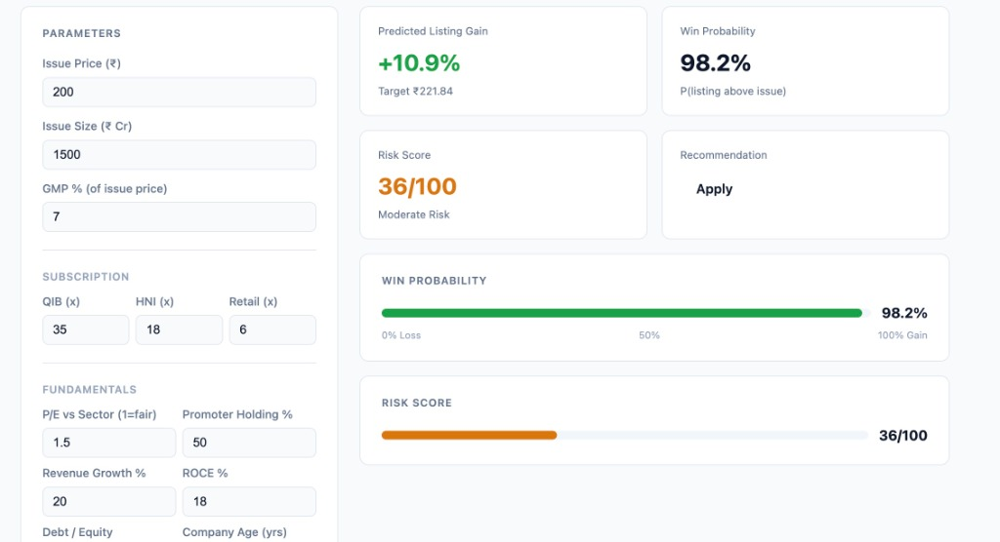

# **IPO Intelligence: Advanced Machine Learning Listing Predictor**

[](https://www.python.org/)
[](https://flask.palletsprojects.com/)
[](https://scikit-learn.org/)
[](https://github.com/niza20/IPO-Intelligence-)

**IPO Intelligence** is a sophisticated predictive analytics platform designed to forecast the listing outcomes of Initial Public Offerings (IPOs). By leveraging a high-performance machine learning pipeline, rule-based data synthesis, and advanced class-balancing techniques, the system provides high-confidence estimates for listing success and potential percentage gains. This project serves as a robust tool for investors and analysts seeking data-driven decision support in the capital markets.

---

## **Key Features**

*   **High-Accuracy Classification**: Evaluates listing potential using a Soft-Voting Ensemble (XGBoost, Random Forest, Gradient Boosting, and Logistic Regression) with a **94.3% classification accuracy**.
*   **Predictive Dashboard**: A professional web-based interface for real-time inference and exploratory data analysis.
*   **Data Integrity and Synthesis**: Utilizes specialized rule-based synthetic data generation and SMOTE (Synthetic Minority Over-sampling Technique) to ensure balanced and representative training sets.
*   **Quantitative Performance Metrics**: Delivers precise listing gain forecasts with an optimized regression model.
*   **Sector-Specific Normalization**: Comprehensive support for diverse industrial sectors including Tech, Finance, Pharma, Infrastructure, FMCG, Automobile, Retail, and Manufacturing.

---

## **Dashboard Overview**

The following captures demonstrate the interactive prediction interface and result summaries.




---

## **Technical Infrastructure**

| Component | Technology |
| :--- | :--- |
| **Programming Language** | Python 3.12 |
| **Framework** | Flask |
| **ML Libraries** | Scikit-Learn, XGBoost, Imbalanced-Learn |
| **Data Engineering** | Pandas, NumPy, KNN Imputation |
| **Analytics Visualization** | Matplotlib, Seaborn |

---

## **Performance Benchmarks**

The model undergoes rigorous validation to maintain high predictive stability across various market conditions.

| Metric | Accuracy / Value |
| :--- | :--: |
| **Classification Accuracy** | **94.3%** |
| **AUC-ROC Score** | **0.985** |
| **Regression Mean Absolute Error** | **±12.98%** |
| **Regression R²** | **0.680** |

---

## **Explanatory Analysis**

The pipeline generates detailed diagnostic plots to monitor feature influence and model reliability.

### **Feature Influence and Market Distribution**


### **Model Reliability and Residual Analysis**


---

## **Operational Setup**

### **Prerequisites**
```bash
git clone https://github.com/niza20/IPO-Intelligence-.git
cd IPO-Intelligence-
pip install -r requirements.txt
```

### **Maintenance and Model Training**
To refresh the data and retrain the models:
```bash
python generate_synthetic_data.py
python train.py
```

### **Execution**
```bash
python app.py
```
Access the local dashboard at `http://127.0.0.1:5001`.

---

## **Project Organization**

*   `app.py`: Backend architecture and routing.
*   `train.py`: Model training, hyperparameter tuning, and cross-validation scripts.
*   `generate_synthetic_data.py`: Rule-based logic for synthetic row generation.
*   `models/`: Repository for serialized model artifacts and metadata.
*   `static/`: Assets, stylesheets, and generated diagnostic visualizations.
*   `templates/`: UI presentation layers.

---

## **License**

Distributed under the MIT License.

---

<p align="center">
  Professionally generated for IPO Data Analytics
</p>
