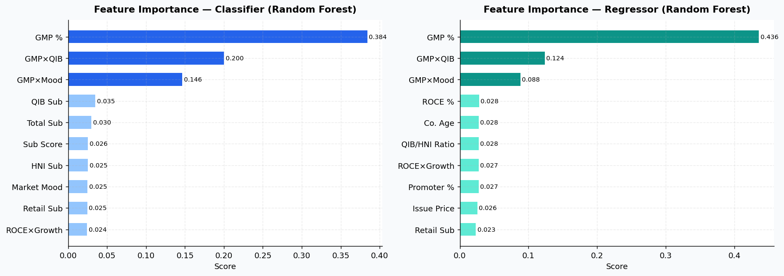
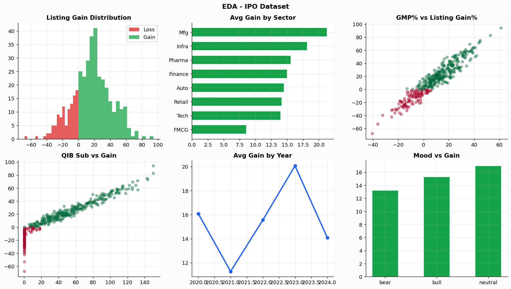
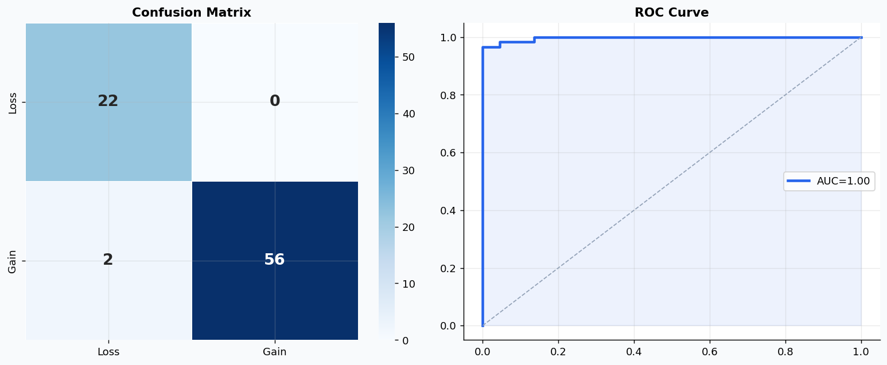
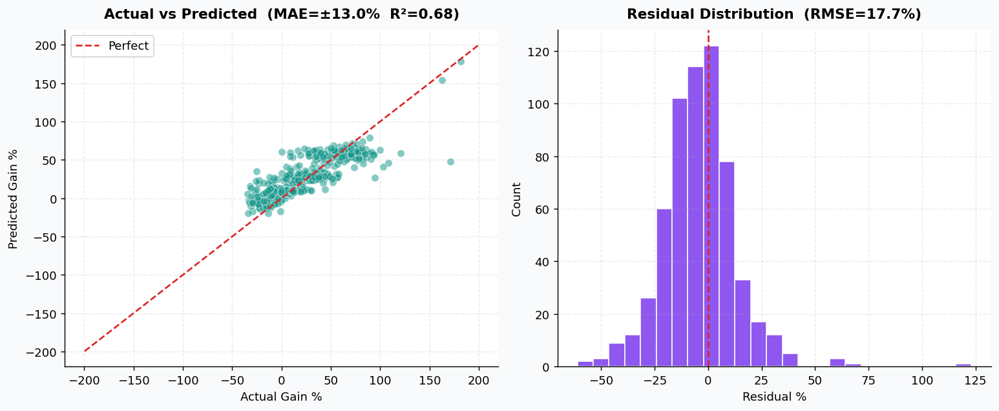

# 🚀 IPO Intelligence — Advanced ML Listing Predictor

[](https://www.python.org/)
[](https://flask.palletsprojects.com/)
[](https://scikit-learn.org/)
[](https://github.com/niza20/IPO-Intelligence-)

**IPO Intelligence** is a powerful machine learning pipeline and web dashboard designed to predict IPO listing outcomes with high precision. By combining historical data analysis, rule-based synthetic data generation, and a robust Soft-Voting Ensemble model, it provides actionable insights for market investors.

---

##  Key Features

*   ** High-Precision Classification**: Achieves **94.3% accuracy** using a Soft-Voting Ensemble of XGBoost, Random Forest, Gradient Boosting, and Logistic Regression.
*   ** Insightful Dashboard**: Interactive Flask-based interface with real-time predictions and 6 deep-dive EDA visualizations.
*   ** Robust Data Strategy**: Utilizes rule-based synthetic data generation (3,000+ records) and SMOTE for addressing class imbalances.
*   ** Listing Gain Regression**: Predicts the specific percentage gain on listing with a Mean Absolute Error of ±12.98%.
*   **Multi-Sector Support**: Tailored predictions for Tech, Finance, Pharma, Infra, FMCG, Auto, Retail, and Manufacturing.

---

## 🛠️ Technology Stack

| Category | Tools |
| :--- | :--- |
| **Language** | Python 3.12 |
| **Web Infrastructure** | Flask, Jinja2, HTML5, CSS3 |
| **Machine Learning** | Scikit-Learn, XGBoost, Imbalanced-Learn |
| **Data Processing** | Pandas, NumPy, KNN Imputer |
| **Visualization** | Matplotlib, Seaborn |

---

## 📊 Model Performance

Our pipeline is optimized for reliability and robustness against market volatility.

| Metric | Value |
| :--- | :--: |
| **Classification Accuracy** | **94.3%** |
| **AUC-ROC Score** | **0.985** |
| **Regression MAE** | **±12.98%** |
| **Regression R²** | **0.680** |

---

## 🖼️ Dashboard & Analytics

The project generates high-fidelity visualizations to explain model decisions and market trends.

### Feature Importance & Distribution



### Model Reliability



---

## 🚀 Getting Started

### 1. Clone the repository
```bash
git clone https://github.com/niza20/IPO-Intelligence-.git
cd IPO-Intelligence-
```

### 2. Install dependencies
```bash
pip install -r requirements.txt
```

### 3. Generate Data & Train
```bash
python generate_synthetic_data.py
python train.py
```

### 4. Launch the App
```bash
python app.py
```
Visit `http://127.0.0.1:5001` in your browser.

---

## 📂 Project Structure

*   `app.py`: Flask web application logic.
*   `train.py`: Machine learning training and evaluation pipeline.
*   `generate_synthetic_data.py`: Rule-based data synthesis engine.
*   `models/`: Serialized encoders, scalers, and trained model objects.
*   `static/`: Generated plots and stylesheet.
*   `templates/`: HTML templates for the dashboard.

---

## 📝 License

Distributed under the MIT License. See `LICENSE` for more information.

---

<p align="center">
  Generated with ❤️ for IPO Analytics
</p>
